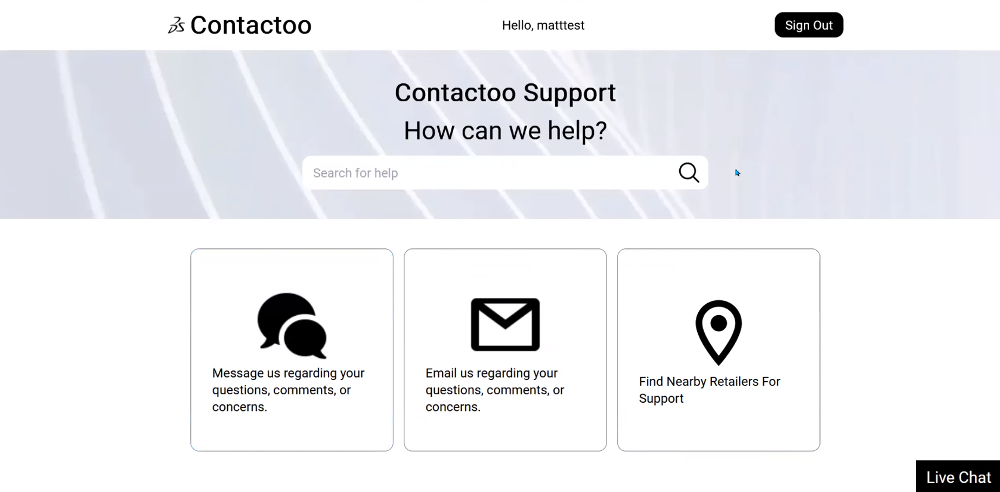
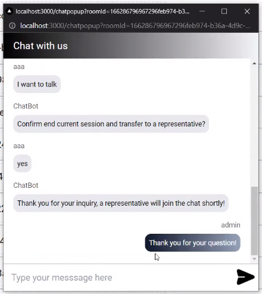
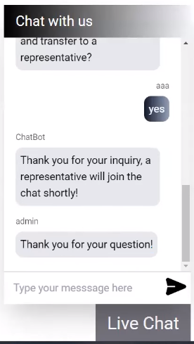

# Contactoo

Contactoo is a customer service website where you can live chat with an AI chatbot, talk to a representitive, email or send an SMS message to the retailer, and find a nearby retailers on Google Maps.

## Sign In Page

## Home Page (Signed in as a *customer*)

## Home Page/Ticket Page (Signed in as a *retailer/admin*)

## Live Chat 

### To alleviate the workload of the representatives/retailers, we implemented an AI chatbot to handle the basic queries from the user:

### The user can ask to talk to a human representative:

### The representative/retailer can manage multiple tickets/user requests and reply to the customers:

#### Ticket Management

#### Reply to Previous User Request

## Email the Retailer

## Send an SMS Message to the Retailer

## Find a Retailer on Google Maps

## Video Demo

[A **very rushed** video demo *(there was a time limit)*](https://youtu.be/UJcYY58Rsu4?si=JjmcvJ2U8_n86sxR)

## Tech Stack

* **Frontend**: Next.js, TailwindCSS
* **Backend**: AWS (Amplify, Cognito, GraphQL, DynamoDB, Amazon Lex)
